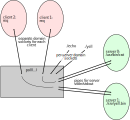

# Nameserver: A Dynamic Service Communication Hub

## Project Description

Nameserver enabling seamless communication between clients and a range of servers or services within a network. This system is analogous to DNS in web browsing, translating human-readable service names into specific service endpoints. The core functionality lies in its ability to direct client requests to the correct service based on unique service identifiers.

### Key Components

1. **Clients**: Utilize a predefined program `req` for client-side operations. This tool sends input to the server and relays the server's response back to the user.
2. **Servers**: Simple, independent programs that process client requests and send back responses. These are housed in the `srv/` directory and require no modifications.
3. **Nameserver**: The central element of the project, responsible for directing client requests to the right server based on the service's unique name.

### Communication Mechanics

- The Nameserver communicates with servers using `pipes`.
- Client-Nameserver interactions are facilitated through domain sockets, enabling dedicated channels for each client.
- Concurrent handling of multiple client requests is achieved using the `poll` method.

### Operational Blueprint

- Each server is linked to a unique domain socket, which is named after the server itself.
- The Nameserver maintains a directory of servers and their names, sourced from a CSV file.
- The project's goal is to evolve from handling a single server to managing multiple servers simultaneously.

### Visualization of System Architecture

A schematic representation of the Nameserver system, illustrating the interactions between clients, the Nameserver, and various servers.



## Example Usage

Here’s how you can interact with the Nameserver system using a single server setup:

```bash
$ ./ns server_map1.csv & sleep 1
$ echo "hello world" | ./req echo
hello world
```

This example demonstrates communicating with an `echo` server through the `req` client, while the Nameserver orchestrates the process.

### Terminating the Nameserver

Manage the running Nameserver with standard shell commands like `jobs`, `fg`, and `cntl-c`.

## System Design

The Nameserver initializes each server at startup, setting up communication channels and domain sockets. It then manages the flow of requests and responses between clients and servers.

## System Components

The project includes a set of predefined data structures such as `struct pollfd`s and `struct server_info`. These structures are adaptable to specific requirements of the system.

## Technical Specifications

- Handles `POLLIN` events primarily, assuming non-blocking `write` operations.
- Adheres to system limits defined in `ns_limits.h`.
- Utilizes a careful approach to error handling, especially for client-induced errors.

## Resources and Tools

- `ns.c`: The core Nameserver code.
- Server scripts located in `srv/*.c`.
- Client-side programs: `req.c` and `req_slow.c`.
- Auxiliary utilities in `poll_helpers.h`.

## Development Focus

The primary objective is to extend existing single-server handling capabilities to a more robust multi-server management system. 

## Inspiration and Context

This project draws inspiration from real-world systems like `systemd` in Linux, emphasizing the importance of efficient communication management in complex networked environments. By developing the Nameserver, you gain valuable insights into the foundational aspects of system communications and service management.
